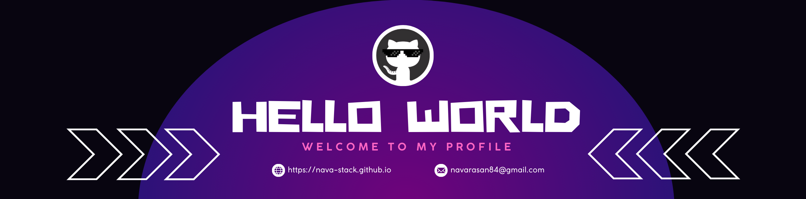

<!--Profile Banner-->  

<!--Dusting-->  

<!--About Section-->  
<h1 align="center">Hi 👋, I'm Navarasan Thirunavukkarasu</h1>
<h3 align="center">Passionate Full-stack developer from Sri Lanka</h3>

  

<!--Table Section--> 
<table align="center">
<tr border="none">
<td width="65%" align="left">

- 🌱 Currently learning **MERN , PERN & Blockchain Technology**

- 🧑‍🎓 An Software Engineering Undergraduate of **LMU**

- 👯 Looking for collaboration on **Building excellent Solutions**

- 💬 Ask me about **React,C#,Java,Python,PHP**

- 📫 How to reach me **navarasan84@gmail.com**

- ⚡ Fun fact **Call me as Nandy**

</td>
<td width="35%" align="center">
  <picture> </picture>
</td>
</tr>
</table>
---
<!--Languages and Tools Section-->  
<h2 align="center"> Languages & Tools  </h2>

- <h3 align="center">📋 Backend </h3>

  

- <h3 align="center">🎨 Frontend</h3>

  

- <h3 align="center">💾 Databases</h3>

  

- <h3 align="center"> Cloud Servers </h3>

  

- <h3 align="center"> Tools </h3>

  

 

##  <b> Github Stats</b>

      
    

<!--Connect with Me Section--> 
<h2 align="center">Connect with Me</h2>

<h2 align="center">Support</h2>

 Created with 🧡 by <a href="#">Navarasan Thirunavukkarasu</a>

